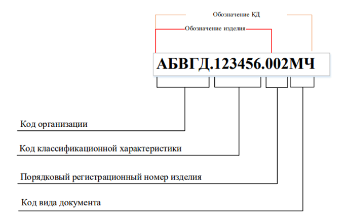

# Единая система конструкторской документации

Перечень стандартов ЕСКД, которые применяются при разработке конструкторской документации.

## Фундаментальный стандарт, определяющие систему

[ГОСТ 2.001-2023](https://internet-law.ru/gosts/gost/81674/) Единая система конструкторской документации. Общие положения.

Это самый главный документ комплекса ЕСКД. Он определяет назначение системы, область ее распространения (машиностроение и приборостроение), классификацию стандартов в ее составе и правила их обозначения.

## Базовые стандарты ЕСКД

Данная группа стандартов устанавливает номенклатуру объектов разработки (виды изделий), определяет состав и комплектность конструкторской документации, а также регламентирует этапы ее создания.

|Обозначение|Наименование стандарта|Назначение|
|----------|----------------------|-----------|
|[ГОСТ Р 2.101-2023](https://internet-law.ru/gosts/gost/81640/)|Единая система конструкторской документации. Виды изделий|Устанавливает классификацию изделий (детали, сборочные единицы, комплексы, комплекты)|
|[ГОСТ Р 2.102-2023](https://internet-law.ru/gosts/gost/81642/)|Единая система конструкторской документации. Виды и комплектность конструкторских документов|Определяет, какие бывают конструкторские документы (чертежи, схемы, спецификации, пояснительные записки и др.) и их комплектность|
|[ГОСТ 2.103-2013](https://internet-law.ru/gosts/gost/58835/)|Единая система конструкторской документации. Стадии разработки|Устанавливает стадии разработки (техническое предложение, эскизный проект, технический проект, рабочая документация)|
|[ГОСТ 2.104-2023](https://internet-law.ru/gosts/gost/81679/)|Единая система конструкторской документации. Основные надписи|Регламентирует формы, размеры и порядок заполнения основных надписей на чертежах и текстовых документах|
|[ГОСТ 2.105-2019](https://internet-law.ru/gosts/gost/70827/)|Единая система конструкторской документации. Общие требования к текстовым документам|Устанавливает общие правила построения, изложения и оформления любых текстовых конструкторских документов (структура, язык, шрифты, нумерация, формулы, таблицы и т.д.)|
|[ГОСТ Р 2.106-2019](https://internet-law.ru/gosts/gost/70838/)|Единая система конструкторской документации. Текстовые документы|Устанавливает конкретные формы и правила заполнения (выполнения) отдельных видов текстовых документов (спецификаций, ведомостей, пояснительных записок и др.)|
|[ГОСТ 2.109-2023](https://internet-law.ru/gosts/gost/81646/)|Единая система конструкторской документации. Основные требования к чертежам|Определяет общие требования к выполнению рабочих чертежей деталей, сборочных, габаритных и монтажных чертежей|
|[ГОСТ 2.111-2013](https://internet-law.ru/gosts/gost/55718/)|Единая система конструкторской документации. Нормоконтроль|Устанавливает правила проведения нормоконтроля конструкторской документации|
|[ГОСТ 2.114-2016](https://internet-law.ru/gosts/gost/63336/)|Единая система конструкторской документации. Технические условия|Правила построения, изложения и оформления технических условий|
|[ГОСТ 2.201-2023](https://internet-law.ru/gosts/gost/81675/)|Единая система конструкторской документации. Обозначение изделий и конструкторских документов|Устанавливает единую систему обозначений для изделий и их конструкторских документов|
|[ГОСТ 2.503-2023](https://internet-law.ru/gosts/gost/81752/)|Единая система конструкторской документации. Правила внесения изменений|Устанавливает правила внесения изменений в конструкторские документы|

## Текстовые конструкторские документы

ГОСТ Р 2.106-2019 Единая система конструкторской документации. Текстовые документы

Основной стандарт, регламентирующий правила выполнения и оформления следующих текстовых документов:

1. Документы, содержащие текст, разбитый на графы

    

      
    - Спецификация (СП)

    - Ведомость спецификаций (ВС)

    - Ведомость ссылочных документов (ВД)

    - Ведомосить покупных изделий (ВП)

    - Ведомость разрешения применения покупных изделий (ВИ)

    - Ведомость держателей подлинников (ДП)

    - Ведомость технического предложения (ПТ)

    - Ведомость эскизного проекта (ЭП)

    - Ведомость технического проекта (ТП)

    - Таблицы (ТБ)

    

    !!! note "Примечание"

        Можно использовать готовые шаблоны документов, имеющиеся в программе Компас-3D.

2. Документы, содержащие в основном сплошной текст

    

    - Пояснительная записка (ПЗ) - [шаблон]()

    - Программа и методика испытаний (ПМ) - [шаблон]()

    - Расчет (РР) - [шаблон]()

    - Инструкция (И)

    

## Чертежи

[ГОСТ 2.109-2023](https://internet-law.ru/gosts/gost/81646/) - Единая система конструкторской документации. Основные требования к чертежам

Устанавливает на стадии разработки рабочей конструкторской документации основные требования к выполнению чертежей, включая:

- Чертежей деталей (ЧД)

- Сборочных чертежей (СБ)

- Габаритных чертежей (ГЧ)

- Монтажных чертежей (МЧ)

!!! note "Примечание"

    При выполнении чертежей можно использовать готовые шаблоны файлов Компас-3D, в которых уже настроена рамка и заполнены постоянные части основной надписи (штампа). Это ускоряет процесс оформления и обеспечивает единый стиль.

## Технические условия

ГОСТ 2.114-2016 - Единая система конструкторской документации. Технические условия

Определяет общие требования, правила и нормы к выполнению технических условий (код ТУ).

Шаблон документа: [Технические условия]()

## Эксплуатационные документы

[ГОСТ Р 2.601-2019](https://internet-law.ru/gosts/gost/70828/) - Единая система конструкторской документации. Эксплуатационные документы

Устанавливает виды, комплектность и общие требования к выполнению эксплуатационных документов, включая:

- Руководство по эксплуатации (РЭ) - [шаблон]()

- Формуляр (ФО) - [шаблон]()

- Паспорт (ПС) - [шаблон]()

- Этикетка (ЭТ) - [шаблон]()

- Ведомость эксплуатационных документов (ВЭ)

- Инструкция по монтажу, пуску, регулированию и обкатке (ИМ) - [шаблон]()

!!! note "Примечание"

    Построение, содержание и изложение эксплуатационных документов осуществляется в соовтетствии с требованиями [ГОСТ 2.610-2019](https://internet-law.ru/gosts/gost/70883/)

## Ремонтные документы

[ГОСТ 2.602-2013](https://internet-law.ru/gosts/gost/55723/) - Единая система конструкторской документации. Ремонтные документы

Устанавливает стадии разработки, виды, комплектность и правила выполнения ремонтных документов, включая:

- Руководство по ремонту (РР)

- Технические условия на ремонт (ТУР)

- Ремонтные чертежи

- Ведомость документов для ремонта (ВДР)

## Схемы

[ГОСТ 2.701-2008](https://internet-law.ru/gosts/gost/47901/) - Единая система конструкторской документации. Схемы. Виды и типы. Общие требования к выполнению

Распространяется на все виды схем и устанавливает общие требования к их выполнению.

Для конкретных типов схем существуют отдельные стандарты:

- [ГОСТ 2.702-2011](https://internet-law.ru/gosts/gost/51102/) - Единая система конструкторской документации. Правила выполнения электрических схем

- [ГОСТ 2.711-2023](https://internet-law.ru/gosts/gost/81671/) - Единая система конструкторской документации. Схема деления изделия на составные части

!!! note "Примечание"

    При разработке схем в Компас-3D рекомендуется использовать готовые шаблоны документов, содержащие настроенную рамку и основную надпись. Это позволяет сразу приступить к построению логики схемы, не отвлекаясь на вычерчивание элементов оформления листа.

## Документы в электронной форме

Для документов, выполняемых в электронной форме, дополнительно применяются:

- [ГОСТ Р 2.051-2023](https://internet-law.ru/gosts/gost/81638/) - Единая система конструкторской документации. Электронная конструкторская документация. Основные положения

- [ГОСТ Р 2.052-2024](https://internet-law.ru/gosts/gost/84079/) - Единая система конструкторской документации. Электронная геометрическая модель изделия. Основные положения

- [ГОСТ Р 2.053-2023](https://internet-law.ru/gosts/gost/81645/) - Единая система конструкторской документации. Электронная структура изделия. Основные положения

## Структура обозначения изделия и конструкторских документов

Правила обозначения изделия и конструкторских документов устанавливает ГОСТ 2.201-2023. При обозначении изделий применяют два способа:

- Обезличенный способ.
- Объектно-ориентированный способ.

/// caption
Структура обозначения изделия и конструкторских документов
///
