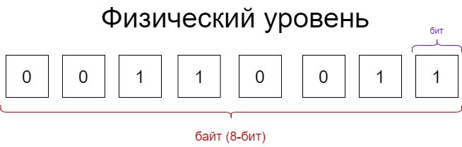
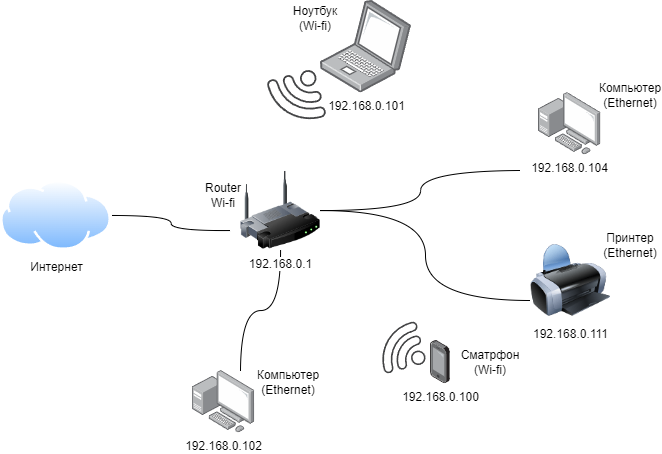
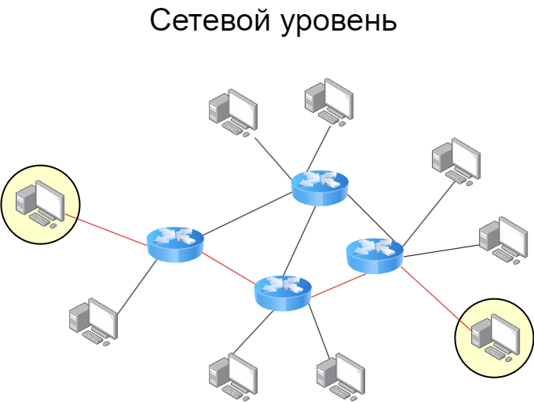
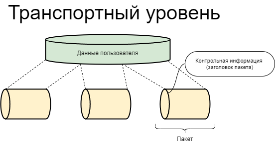
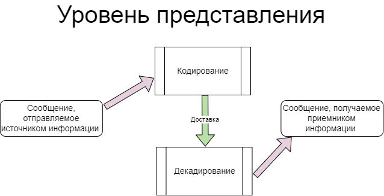
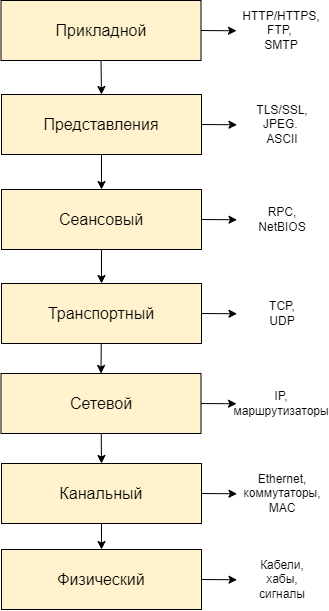

# Сетевая модель OSI

**OSI (Open Systems Interconnection)** — это эталонная модель, которая описывает, как данные передаются от одного устройства к другому по сети. В мире информационных технологий это позволяет производителям создавать оборудование и программы, которые гарантированно будут работать друг с другом.

Сетевая модель OSI состоит из 7 уровней. Данные путешествуют сверху вниз (от программы к сетевому кабелю) на отправляющей стороне и снизу вверх (от кабеля к программе) на принимающей.

## Уровень 1: Физический (Physical)

Физический уровень OSI отвечает за передачу сигналов и включает аппаратную часть соединения:

- медные кабели - передают информацию с помощью электрических импульсов;

- оптоволокно - работает за счет световых сигналов;

- беспроводные сети - доставляют информацию с помощью радиоволн.

/// caption
  Информация передается в виде двоичного кода
///

<!-- !!! note
    Информация передается в виде двоичного кода. -->

К физическому уровню модели можно отнести контакты в разъемах, концентраторы и репитеры. Концентраторы соединяют несколько компьютеров по локальной сети (LAN), а репитеры увеличивают расстояние передачи сигнала.

Оборудование физического уровня не фильтруют трафик, а просто осуществляют механическую передачу по проводам.

## Уровень 2: Канальный (Data Link)

Канальный уровень модели OSI объединяет устройства в одной локальной сети, например компьютеры, принтеры и коммутаторы. Его функция — правильно передать данные между этими узлами.

/// caption
  Канальный уровень объединяет устройства в сети LAN
///

На канальном уровне происходит:

- **Форматирование**: данные делятся на фреймы (или кадры) и готовятся к последующей передаче. К ним добавляется информация о том, откуда они пришли и куда направляются.

- **Определение MAC-адреса**: у каждого устройства есть уникальный идентификатор. Его присваивают на заводе во время сборки. С помощью MAC-адреса компьютер понимает, куда отправить данные.

- **Контроль ошибок**: канальный уровень проверяет, правильно ли были получены данные. Если есть ошибки, например данные искажены, он может запросить повторную отправку.

Канальный уровень управляет доступом к физической среде. Следит, чтобы все устройства сети получили доступ к проводам или беспроводным сигналам, и помогает избежать конфликтов при передаче данных.

## Уровень 3: Сетевой (Network)

Сетевой уровень модели OSI определяет пути передачи данных. Для этого используют маршрутизаторы — это своеобразный «навигатор», он выбирает наиболее удобный и короткий путь от одного устройства до другого.

/// caption
  Маршрутизаторы выбирают подходящий маршрут для передачи информации
///

На сетевом уровне происходит:

- **IP-адресация**: у каждого устройства в интернете есть свой уникальный IP-адрес. С помощью протокола ARP адрес MAC конвертируется в IP.

- **Фрагментация**: если данные слишком большие, для удобства доставки их разбивают на более мелкие части — фрагменты.

- **Контроль трафика**: сетевой уровень управляет потоком данных между устройствами и сетями, чтобы избежать перегрузки.

## Уровень 4: Транспортный (Transport)

Транспортный уровень сети отвечает за связь двух устройств по внешней сети. Для этого он разбивает данные на пакеты, а потом собирает их обратно.

/// caption
  Для транспортировки данные делятся на пакеты
///

Важно чтобы данные были доставлены без ошибок. Если какой-то пакет потеряется или повредится, транспортный уровень может запросить повторную отправку.

Чтобы не перегружать приемник, транспортный уровень контролирует скорость передачи данных и управляет потоком. Благодаря этому мы можем совершать несколько действий в сети одновременно, например смотреть видео и загружать файлы.

## Уровень 5: Сеансовый (Session)

Сеансовый уровень обеспечивает сеанс связи между приложениями. Например, во время звонка в мессенджерах активируются два потока данных — видео и звук, — они должны идти синхронно и последовательно, чтобы собеседники могли правильно понять друг друга.

Также пятый уровень модели OSI управляет сессиями. Если во время звонка произошел сбой и связь прервалась, он постарается ее восстановить.

## Уровень 6: Представления (Presentation)

Шестой уровень OSI отвечает за обработку данных перед отправкой. Он переводит их в удобный для пользователя формат, например PDF, AVI, PNG.

На уровне представления данных происходит:

- **Кодирование и декодирование**: преобразование сигнала в форму, подходящую для передачи.

- **Сжатие**: уменьшение объема данных. Это позволяет быстрее передавать файлы и экономить пропускную способность сети.

- **Шифрование**: преобразование данных в вид, недоступный для чтения. Это помогает защитить личную информацию от несанкционированного доступа.

Например, перед отправкой большого документа коллеге мы можем сжать их в ZIP-файл и добавить шифрование, чтобы никто другой не мог их увидеть.

/// caption
  Кодирование информации
///

## Уровень 7: Прикладной (Application)

Это верхний уровень модели OSI, он взаимодействует с самим пользователем. К нему относятся веб-браузеры, почтовые клиенты (Outlook), мессенджеры, которые обеспечивают доступ в сеть с помощью специального интерфейса.

На этом уровне используются различные протоколы для обмена данными, например:

- **HTTP/HTTPS**: для загрузки сайтов.

- **SMTP**: для отправки электронной почты.

- **FTP**: для передачи файлов.

## Пример работы сетевой модели OSI

Допустим, мы хотим отправить электронное письмо. Вот что произойдет на каждом этапе:

- **Прикладной уровень**: мы создаем письмо с помощью почтового клиента. Программа формирует сообщение, добавляет адрес получателя, тему и текст.

- **Уровень представления**: наш текст преобразуется в формат, удобный для передачи. Например, он может быть закодирован в UTF-8, а вложения сжаты или закодированы в Base64.

- **Сеансовый уровень**: устанавливает связь между нашим компьютером и почтовым сервером.

- **Транспортный уровень**: данные делятся на пакеты. Протокол TCP добавляет заголовок к каждому сегменту. Они содержат номер последовательности и информацию о портах отправителя и получателя.

- **Сетевой уровень**: сегменты преобразуются в пакеты, определяется IP-адрес адресата и получателя. Это помогает маршрутизаторам правильно направлять пакеты данных.

- **Канальный уровень**: пакеты преобразуются в кадры. IP-адрес конвертируется в MAC, затем кадры передаются по локальной сети.

- **Физический уровень**: данные преобразуются в биты и отправляются в виде электрических, световых или радиосигналов.

Когда письмо, которое мы написали, дойдет до сервера получателя, то процесс запустится в обратном порядке.

/// caption
  Схема взаимодействия каждого уровня
///

